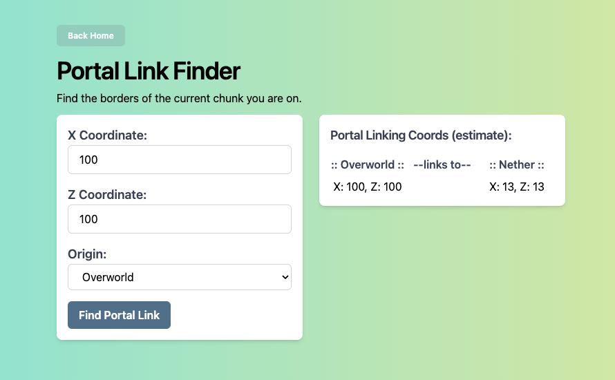
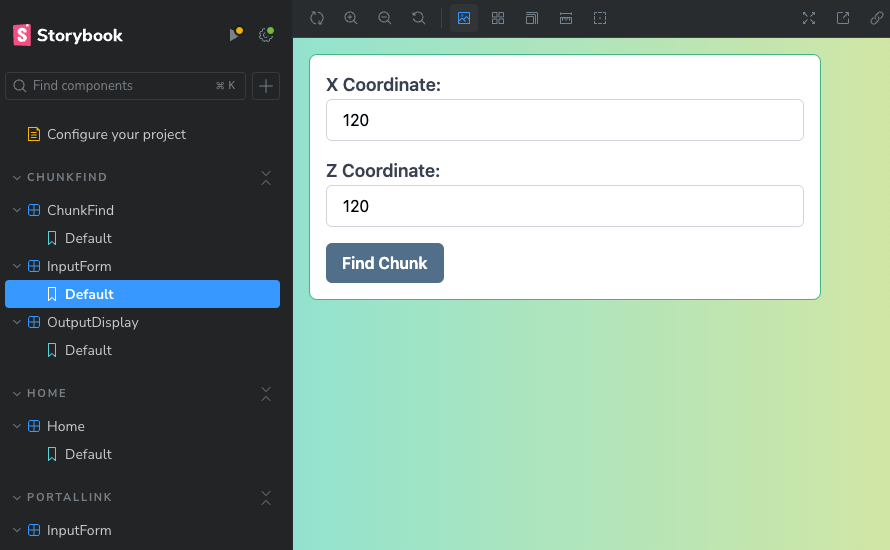

# Simple Minecraft Helpers

Here are a couple of very simple helpers for playing Minecraft.

### Chunk Finder

This tool lets you input your current coordinates (X and Z) and returns the coordinates 
for each corner block of the chunk you are currently on. This is very handy for certain 
farms that either need to cross chunk borders together, such as flying machines, or ones 
that must be built entirely inside a chunk due to the risk of them breaking.

### Portal Linker

Provide the source coordinates (where you currently are), and it will tell you where in 
the Nether those coordinates will link to, or vice versa, where you will exit from the 
Nether when creating a portal. While it's not exact, since Minecraft will create the 
portal in the general area and at a random Y level, this tool helps when trying to reach 
distant lands via a Nether hub.

# But Why?

This simple website was created to test the following languages/frameworks. I wanted 
to learn about all of these and see how they work together. So, I converted these 
helpers from shell scripts into a React UI.

* React
* Vite
* Tailwind
* Storybook

# Development

If you want to get this running locally, simply download it and follow these steps:

1. Follow the instructions for your OS to install Node: https://nodejs.org/
2. Open the application folder in a Terminal/Command Line.
3. Install the application dependencies:

        npm install

4. Start the development server:

        npm run dev

5. Start the Storybook server (if you want to see how that looks):

        npm run storybook

# Disclaimer

This project was created to help me learn about these various frameworks, 
so it may not follow the "best practices" for any of them. However, I hope it 
helps you get up and running with your personal projects.